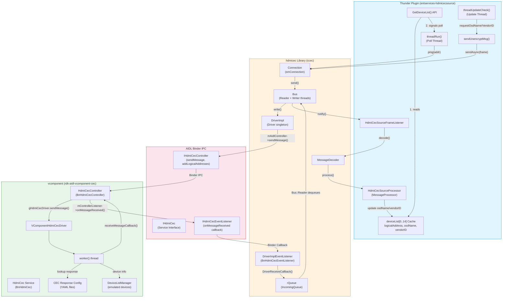

# Architecture: GetDeviceList and CEC Communication Stack

This diagram shows the overall architecture of how the `GetDeviceList()` API communicates through the hdmicec library, AIDL binder IPC, and vcomponent service.

## Key Components

### Thunder Plugin Layer (Blue)
- **GetDeviceList()**: Returns cached device data and triggers async polling
- **deviceList[] Cache**: Stores device info (logical address, OSD name, vendor ID)
- **Background Threads**: Poll thread discovers devices, update thread fetches details

### hdmicec Library Layer (Orange)
- **Connection**: Manages CEC frame sending/receiving
- **Bus**: Reader/Writer threads for async I/O
- **DriverImpl**: Interfaces with AIDL binder for actual hardware communication

### AIDL Binder IPC Layer (Red)
- Cross-process communication boundary
- Synchronous calls (sendMessage) and asynchronous callbacks (onMessageReceived)

### vcomponent Service Layer (Green)
- Emulates CEC hardware/devices
- Loads device configurations from YAML files
- Generates CEC responses based on opcode and device state
