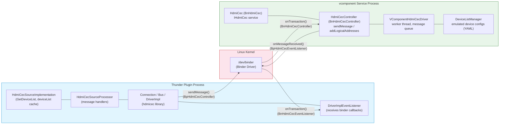

# Process Architecture: Binder IPC Between Plugin and vcomponent

This diagram shows how the Thunder plugin process and vcomponent service process communicate across the Linux kernel's binder driver.



## Process Separation

### Thunder Plugin Process (Blue)
- Runs as part of the WPEFramework/Thunder
- Contains the HdmiCecSource plugin implementation
- Links against hdmicec library (libccec.so)
- Uses **Bp** (Binder Proxy) stubs to make calls to vcomponent

### Linux Kernel Binder Driver (Red)
- `/dev/binder` character device
- Provides IPC mechanism between processes
- Handles data marshaling/unmarshaling
- Manages reference counting and death notifications

### vcomponent Service Process (Green)
- Separate daemon process (typically runs as system service)
- Implements **Bn** (Binder Native) stubs to receive calls
- Emulates CEC hardware behavior
- Loads device configurations from YAML files in `vcomponent_configurations/`

## Binder Communication Paths

### Outbound (Plugin → vcomponent)
```
DriverImpl::write()
  → mAidlController->sendMessage()  [BpHdmiCecController proxy]
  → /dev/binder kernel driver
  → HdmiCecController::sendMessage()  [BnHdmiCecController native]
  → VComponentHdmiCecDriver
```

### Inbound (vcomponent → Plugin)
```
VComponentHdmiCecDriver::receiveMessage()
  → mReceiveMessageCallback()
  → mControllerListener->onMessageReceived()  [BpHdmiCecEventListener proxy]
  → /dev/binder kernel driver
  → DriverImplEventListener::onMessageReceived()  [BnHdmiCecEventListener native]
  → DriverReceiveCallback() → rQueue
```

## AIDL Generated Code

The binder proxies and stubs are generated from AIDL definitions:
- `IHdmiCec.aidl` - Service interface
- `IHdmiCecController.aidl` - Controller interface for sending messages
- `IHdmiCecEventListener.aidl` - Callback interface for receiving messages

Generated classes:
- **Bp** = Binder Proxy (client side)
- **Bn** = Binder Native (server side)
- **I** = Interface definition
