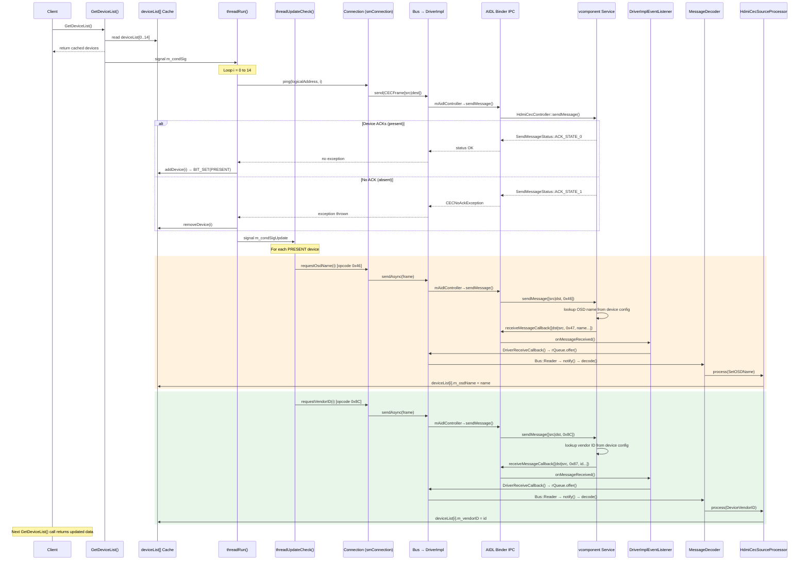

# Sequence Flow: GetDeviceList Device Discovery via AIDL Binder

This diagram shows the detailed sequence of operations when `GetDeviceList()` is called and how device information is retrieved through the CEC bus via AIDL binder.

## Flow Explanation

### Phase 1: API Call (Synchronous)
1. Client calls `GetDeviceList()`
2. API immediately reads and returns cached `deviceList[0..14]`
3. API signals poll thread to start discovery

### Phase 2: Device Discovery (Asynchronous)
1. Poll thread pings each logical address (0-14)
2. Each ping goes through: Connection → Bus → DriverImpl → AIDL binder → vcomponent
3. vcomponent responds with ACK or NACK based on device presence
4. ACK → `addDevice()` marks device as present
5. NACK → `removeDevice()` clears device

### Phase 3: Detail Fetching (Asynchronous)
**Orange box - OSD Name Request:**
- Sends CEC opcode `0x46` (Give OSD Name)
- Response opcode `0x47` (Set OSD Name) comes back through binder callback
- Updates `deviceList[i].m_osdName`

**Green box - Vendor ID Request:**
- Sends CEC opcode `0x8C` (Give Device Vendor ID)
- Response opcode `0x87` (Device Vendor ID) comes back through binder callback
- Updates `deviceList[i].m_vendorID`

### Phase 4: Subsequent Calls
Next `GetDeviceList()` call returns the populated cache with all device details.
